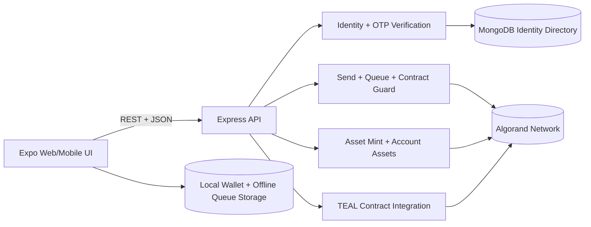

# GhostPay

GhostPay is an offline-first Algorand payment app with a mobile-number identity layer.

It combines:

- Expo app (web + mobile) for wallet UX, queueing, and sync
- Node.js backend for identity verification, contract operations, and chain interactions
- MongoDB identity directory mapping mobile identifiers to verified wallets

## Why GhostPay

Traditional payment experiences break in poor networks. GhostPay lets users stage transactions offline and settle later, while enforcing identity-driven transfer rules.

## Key Features

- Offline queue for payments with reconnect sync
- Multi-wallet local management (add, import, switch active)
- One-time mnemonic reveal popup with copy support
- Mobile OTP identity linking
- Identity enforcement on send:
- sender wallet must be linked to a verified mobile identifier
- receiver wallet must be linked to a verified mobile identifier
- Mobile identifier lookup and wallet directory
- Mint test assets and view account assets
- Optional Algorand smart-contract enforcement for sends
- USD and ALGO send amount modes

## Identity Rules

- One mobile identifier can have multiple wallets
- Exactly one primary wallet per mobile identifier
- Linked-mobile verification is enforced by backend before send
- Send flow is identifier-first (receiver is resolved via mobile number)

## Tech Stack

- Frontend: Expo, React Native, Expo Router, Zustand, Reanimated
- Backend: Node.js, Express, TypeScript, Mongoose
- Blockchain: Algorand SDK
- Identity: MongoDB + OTP (Twilio or local dev mode)

## Repository Structure

```text
ghostpay/
  app/                     Expo app (web + mobile)
  backend/                 Express API + Algorand + identity
    contracts/             TEAL contracts
    src/scripts/           deployment scripts
  README.md
```

## Architecture Diagram



## Quick Start

### 1) Install dependencies

```bash
npm install
```

### 2) Configure backend environment

Create and edit backend env at backend/.env.

Minimum required values:

```env
PORT=4000
CORS_ORIGIN=*

MONGODB_URI=<your_mongodb_uri>
MONGODB_DB_NAME=ghostpay

ALGORAND_NETWORK=testnet
ALGORAND_ALGOD_SERVER=https://testnet-api.algonode.cloud
ALGORAND_ALGOD_PORT=
ALGORAND_ALGOD_TOKEN=
ALGORAND_SENDER_MNEMONIC=<funded_25_word_mnemonic>

ALLOW_DEMO_MODE=true
MAX_ALGO_PER_TX=1000
CONFIRMATION_ROUNDS=6

GHOSTPAY_CONTRACT_APP_ID=0
ENFORCE_CONTRACT=false
```

Optional OTP providers:

```env
SMS_PROVIDER=twilio
TWILIO_ACCOUNT_SID=
TWILIO_AUTH_TOKEN=
TWILIO_FROM_NUMBER=
REVEAL_OTP_IN_RESPONSE=false
```

### 3) Run locally

Backend + Expo native entry:

```bash
npm run dev
```

Backend + web:

```bash
npm run dev:web
```

## Smart Contract Deployment

Deploy from backend:

```bash
cd backend
npm run deploy:contract
```

On success, the deploy script auto-updates backend/.env with:

- GHOSTPAY_CONTRACT_APP_ID=<new_app_id>
- ENFORCE_CONTRACT=true

## Main Flows

### Wallet flow

1. Create or import wallet
2. Save one-time mnemonic backup
3. Add multiple wallets and switch active wallet

### Identity flow

1. Request OTP for mobile identifier
2. Verify OTP and link active wallet
3. Contacts page shows linked identifier and lookup tools

### Send flow

1. Resolve receiver via mobile identifier
2. Enter amount in USD or ALGO mode
3. Queue send offline or sync immediately when online
4. Backend enforces sender and receiver identity linkage

## API Overview

### Health

- GET /health

### Algorand

- GET /api/algorand/network
- GET /api/algorand/signer
- GET /api/algorand/balance/:address
- GET /api/algorand/assets/:address
- POST /api/algorand/mint
- POST /api/algorand/send

### Identity

- POST /api/identity/request-verification
- POST /api/identity/send-sms-otp
- POST /api/identity/verify-mobile
- GET /api/identity/mobile/:mobileNumber/wallets
- GET /api/identity/wallet/:walletAddress

## Build Commands

Root:

```bash
npm run build
```

App only:

```bash
npm run typecheck --workspace app
npm run build:web --workspace app
```

Backend only:

```bash
npm run build --workspace backend
```

## Live Links

- Web deployment (Vercel): https://app-3vwi19f7s-harics-projects-ad7a45e9.vercel.app/
- Android APK (Google Drive): https://drive.google.com/file/d/<your-apk-file-id>/view?usp=sharing

## Future Upcoming

- Agentic approach for identity and risk checks:
  add an AI agent layer to monitor transaction intent, detect suspicious patterns, and suggest safer transfer actions before broadcast.
- Agentic support assistant:
  add an in-app assistant to guide users through wallet recovery, mobile linking, and failed transaction remediation.
- Smart routing and reliability:
  improve queue intelligence to prioritize urgent transfers and retry using adaptive network-aware strategies.
- Production hardening:
  complete managed secrets integration, signer isolation, and stronger observability for chain and identity operations.

## Production Notes

- Set ALLOW_DEMO_MODE=false
- Use a dedicated signer wallet with limited hot balance
- Lock CORS_ORIGIN to your deployed frontend domain
- Keep mnemonic out of version control and rotate regularly
- Move signing to a managed secrets system or HSM/KMS for production

## Security Warning

Never commit real private mnemonics. If any mnemonic was exposed during testing, rotate and move funds immediately.
# GhostPay
