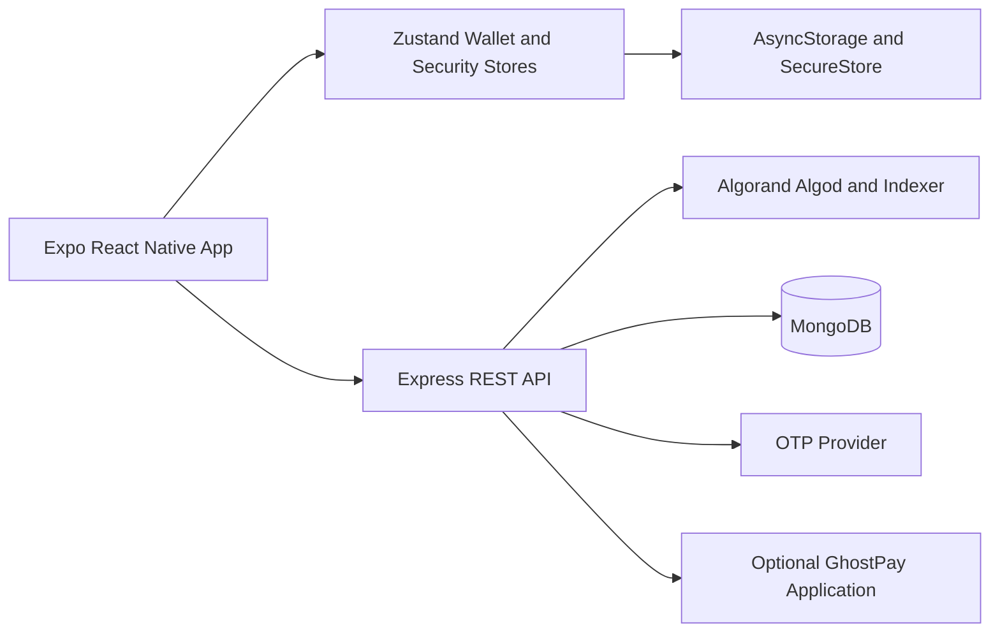
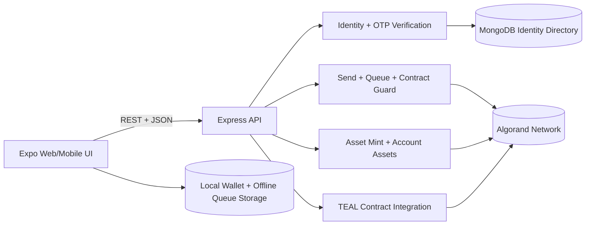

# GhostPay

GhostPay is an Algorand wallet application for mobile-number-based payments. It provides local wallet management, identity linking, payment queueing, transaction history, notifications, analytics, and backend-enforced identity checks.

## Project Status

The repository contains:

- An Expo and React Native client for Android, iOS, and web.
- An Express and TypeScript backend for Algorand operations, identity, accounts, and notifications.
- MongoDB-backed mobile identity and wallet mappings.
- Optional Algorand smart-contract enforcement for payments.
- Local encrypted wallet secret-key storage through Expo SecureStore on supported native platforms.

The paid x402 service endpoint is currently empty and will be added later.

## Implemented Features

### Wallets

- Generate a new Algorand wallet.
- Import a wallet from a 25-word mnemonic.
- Store multiple wallets locally with labels.
- Keep the existing active wallet when another wallet is imported.
- Select the active wallet from the Profile wallet dropdown.
- Use the active wallet for balance, sending, history, analytics, and notifications.
- Remove wallets and clear their locally stored secret keys.
- Display the active wallet address and QR payment code.

### Payments

- Send ALGO to an Algorand address.
- Resolve a recipient from a linked mobile number.
- Scan Algorand and GhostPay payment QR codes.
- Enter amounts in ALGO or a supported fiat display currency.
- Queue payments while offline and synchronize them when connectivity returns.
- Track pending, syncing, confirmed, and failed payment states.
- Require sender and receiver identity verification when enabled by the backend.
- Optionally verify payment groups through the GhostPay Algorand application.
- Protect payment authorization with an optional four-digit PIN or biometric authentication.

### Identity

- Request mobile-number verification by OTP.
- Send OTP by Twilio when configured.
- Verify an OTP and link a wallet to the mobile number.
- Resolve wallets associated with a mobile number.
- Resolve identity information associated with a wallet address.
- Support one mobile number linked to multiple wallets with one primary wallet.

### Wallet-specific views

- Home Recent Activity shows only transactions involving the active wallet.
- History defaults to the active wallet and provides a wallet dropdown for viewing another wallet's transactions.
- Notifications show only notifications for the active wallet.
- Balance and identity information refresh when the active wallet changes.
- Analytics uses the active wallet's transaction data.

### Security and account protection

- Optional app lock using a four-digit PIN.
- Optional biometric unlock through Expo LocalAuthentication.
- One-time mnemonic backup flow.
- Watch-only wallet detection when the local secret key is unavailable.
- Server-side validation of Algorand addresses, amount limits, timestamps, and signed transaction fields.
- Optional API-key protection for account-mapping routes.

## Application Screens

- **Home:** active-wallet balance, wallet identity, QR access, quick actions, and recent activity.
- **Send / Scan:** QR scanning, recipient resolution, amount entry, payment security checks, and offline queueing.
- **Transactions:** wallet selector, search, grouped transaction history, and transaction details.
- **Analytics:** active-wallet payment summaries and spending/receiving analysis.
- **Notifications:** active-wallet payment, identity, security, and system notifications.
- **Profile:** user identity, wallet management, wallet selector, wallet QR code, and mobile linking.
- **Settings:** wallet import, wallet backup, currency, notifications, app lock, biometric access, sync, and disconnect controls.

## Architecture


```mermaid
flowchart LR
  APP[Expo React Native App] --> STORE[Zustand Wallet and Security Stores]
  APP --> API[Express REST API]
  STORE --> LOCAL[AsyncStorage and SecureStore]
  API --> ALGO[Algorand Algod and Indexer]
  API --> DB[(MongoDB)]
  API --> OTP[OTP Provider]
  API --> CONTRACT[Optional GhostPay Application]
```

The active wallet address is the client-side wallet context used by the screens. The backend remains authoritative for Algorand network operations and persisted identity/account mappings.

## Repository Structure

```text
GhostPay/
  app/
    app/                  Expo Router screens
    src/components/       Reusable UI components
    src/services/         REST API client functions
    src/storage/          Platform and wallet-secret storage
    src/store/            Wallet and security state
    src/theme/            Shared visual theme
    assets/               Logos, branding, and app assets
  backend/
    src/routes/           Express route handlers
    src/services/         Algorand, identity, account, and SMS services
    src/models/           MongoDB models
    src/middleware/       API authentication middleware
    contracts/            Algorand TEAL source files
    src/docs/             OpenAPI specification
    src/tests/            Backend tests
  GhostPay.postman_collection.json
  backend/API_CONTRACT.md
  X402_MICROTRANSACTIONS_GUIDE.md
```

## Requirements

- Node.js 18 or newer.
- npm.
- MongoDB for identity and notification persistence.
- An Algorand network endpoint for balance, asset, transaction, and payment operations.
- A funded Algorand signer only when server-signed operations are required.
- Android Studio for Android builds, or Xcode for iOS builds.

## Installation

Install the client dependencies:

```bash
cd app
npm install
```

Install the backend dependencies:

```bash
cd backend
npm install
```

## Backend Configuration

Create `backend/.env` using `backend/.env.example` as a reference.

Important settings include:

```env
PORT=4000
CORS_ORIGIN=*
MONGODB_URI=
MONGODB_DB_NAME=ghostpay
ALGORAND_NETWORK=testnet
ALGORAND_ALGOD_SERVER=
ALGORAND_ALGOD_PORT=
ALGORAND_ALGOD_TOKEN=
ALGORAND_EXPLORER_TX_BASE_URL=
ALGORAND_SENDER_MNEMONIC=
MAX_ALGO_PER_TX=1000
CONFIRMATION_ROUNDS=6
GHOSTPAY_CONTRACT_APP_ID=0
ENFORCE_CONTRACT=false
ACCOUNTS_API_KEY=
```

For SMS verification, configure the Twilio variables and set `SMS_PROVIDER=twilio`. With `SMS_PROVIDER=none`, the backend uses its configured non-SMS verification behavior.

In production, configure `ACCOUNTS_API_KEY` to protect account-mapping endpoints and keep all mnemonic values outside version control.

## Running the Project

Start the backend:

```bash
cd backend
npm run dev
```

Start the Expo client in another terminal:

```bash
cd app
npm run start
```

Other client commands:

```bash
npm run android
npm run ios
npm run web
```

## Backend API

### Health

```text
GET /health
```

### Algorand

```text
GET  /api/algorand/network
GET  /api/algorand/signer
GET  /api/algorand/balance/:address
GET  /api/algorand/assets/:address
GET  /api/algorand/transactions/:address
POST /api/algorand/send
```

The send route validates addresses, amount precision, amount limits, timestamps, optional client-signed transaction fields, identity requirements, and optional contract enforcement before broadcasting.

### Identity

```text
POST /api/identity/request-verification
POST /api/identity/send-sms-otp
POST /api/identity/verify-mobile
GET  /api/identity/mobile/:mobileNumber/wallets
GET  /api/identity/wallet/:walletAddress
```

Identity routes require MongoDB to be configured.

### Account mapping

```text
POST /api/accounts
GET  /api/accounts/phone/:phone
GET  /api/accounts/wallet/:walletId
```

These routes maintain the mapping:

```text
Phone <-> Account <-> Wallet ID <-> Algorand address
```

They use the `requireApiKey` middleware when `ACCOUNTS_API_KEY` is configured.

### Notifications

```text
GET    /api/notifications/:walletAddress
POST   /api/notifications
PATCH  /api/notifications/:id/read
DELETE /api/notifications/:walletAddress
```

Interactive API documentation is available at `/api/docs` when the backend is running.

## Paid x402 Endpoint

```text

```

## Smart Contract

The backend includes TEAL sources for the GhostPay approval and clear programs. Contract deployment is performed from the backend package:

```bash
cd backend
npm run deploy:contract
```

After deployment, configure the application ID in `GHOSTPAY_CONTRACT_APP_ID`. Set `ENFORCE_CONTRACT=true` only when contract enforcement is ready for the configured network.

## Package Scripts

### App (`app/package.json`)

```text
npm run start       Start Expo
npm run android     Run the Android app
npm run ios         Run the iOS app
npm run web         Start Expo web
npm run build:web   Export the web application
npm run typecheck   Run TypeScript validation
```

### Backend (`backend/package.json`)

```text
npm run dev         Start the backend with the TypeScript watcher
npm run build       Compile the backend
npm run start       Start the compiled backend
npm run test        Run backend tests
npm run test:watch  Run backend tests in watch mode
npm run deploy:contract  Deploy the Algorand application
```

## Validation

Run client validation:

```bash
cd app
npm run typecheck
```

Run backend build and tests:

```bash
cd backend
npm run build
npm run test
```

## Security Notes

- Never commit a mnemonic, private key, seed phrase, PIN, or API key.
- Use a dedicated and funded signer account only for the operations that require it.
- Restrict `CORS_ORIGIN` in production.
- Configure `ACCOUNTS_API_KEY` before exposing account-mapping routes publicly.
- Keep MongoDB credentials and Twilio credentials in environment variables.
- Review transaction and identity behavior on the selected Algorand network before production deployment.

GhostPay is an offline-first Algorand payment app with a mobile-number identity layer.

It combines:

- Expo app (web + mobile) for wallet UX, queueing, and sync
- Node.js backend for identity verification, contract operations, and chain interactions
- MongoDB identity directory mapping mobile identifiers to verified wallets

## Why GhostPay

Traditional payment experiences break in poor networks. GhostPay lets users stage transactions offline and settle later, while enforcing identity-driven transfer rules.

## Key Features

- Offline queue for payments with reconnect sync
- Multi-wallet local management (add, import, switch active)
- One-time mnemonic reveal popup with copy support
- Mobile OTP identity linking
- Identity enforcement on send:
- sender wallet must be linked to a verified mobile identifier
- receiver wallet must be linked to a verified mobile identifier
- Mobile identifier lookup and wallet directory
- Mint test assets and view account assets
- Optional Algorand smart-contract enforcement for sends
- USD and ALGO send amount modes

## Identity Rules

- One mobile identifier can have multiple wallets
- Exactly one primary wallet per mobile identifier
- Linked-mobile verification is enforced by backend before send
- Send flow is identifier-first (receiver is resolved via mobile number)

## Tech Stack

- Frontend: Expo, React Native, Expo Router, Zustand, Reanimated
- Backend: Node.js, Express, TypeScript, Mongoose
- Blockchain: Algorand SDK
- Identity: MongoDB + OTP (Twilio or local dev mode)

## Repository Structure

```text
ghostpay/
  app/                     Expo app (web + mobile)
  backend/                 Express API + Algorand + identity
    contracts/             TEAL contracts
    src/scripts/           deployment scripts
  README.md
```

## Architecture Diagram


```mermaid
flowchart LR
    UI[Expo Web/Mobile UI] -->|REST + JSON| API[Express API]
    API --> AUTH[Identity + OTP Verification]
    API --> PAY[Send + Queue + Contract Guard]
    API --> MINT[Asset Mint + Account Assets]
    AUTH --> DB[(MongoDB Identity Directory)]
    PAY --> CHAIN[(Algorand Network)]
    MINT --> CHAIN
    API --> CONTRACT[TEAL Contract Integration]
    CONTRACT --> CHAIN
    UI --> LOCAL[(Local Wallet + Offline Queue Storage)]
```

## Quick Start

### 1) Install dependencies

```bash
npm install
```

### 2) Configure backend environment

Create and edit backend env at backend/.env.

Minimum required values:

```env
PORT=4000
CORS_ORIGIN=*

MONGODB_URI=<your_mongodb_uri>
MONGODB_DB_NAME=ghostpay

ALGORAND_NETWORK=testnet
ALGORAND_ALGOD_SERVER=https://testnet-api.algonode.cloud
ALGORAND_ALGOD_PORT=
ALGORAND_ALGOD_TOKEN=
ALGORAND_SENDER_MNEMONIC=<funded_25_word_mnemonic>

ALLOW_DEMO_MODE=true
MAX_ALGO_PER_TX=1000
CONFIRMATION_ROUNDS=6

GHOSTPAY_CONTRACT_APP_ID=0
ENFORCE_CONTRACT=false
```

Optional OTP providers:

```env
SMS_PROVIDER=twilio
TWILIO_ACCOUNT_SID=
TWILIO_AUTH_TOKEN=
TWILIO_FROM_NUMBER=
REVEAL_OTP_IN_RESPONSE=false
```

### 3) Run locally

Backend + Expo native entry:

```bash
npm run dev
```

Backend + web:

```bash
npm run dev:web
```

## Smart Contract Deployment

Deploy from backend:

```bash
cd backend
npm run deploy:contract
```

On success, the deploy script auto-updates backend/.env with:

- GHOSTPAY_CONTRACT_APP_ID=<new_app_id>
- ENFORCE_CONTRACT=true

## Main Flows

### Wallet flow

1. Create or import wallet
2. Save one-time mnemonic backup
3. Add multiple wallets and switch active wallet

### Identity flow

1. Request OTP for mobile identifier
2. Verify OTP and link active wallet
3. Contacts page shows linked identifier and lookup tools

### Send flow

1. Resolve receiver via mobile identifier
2. Enter amount in USD or ALGO mode
3. Queue send offline or sync immediately when online
4. Backend enforces sender and receiver identity linkage

## API Overview

### Health

- GET /health

### Algorand

- GET /api/algorand/network
- GET /api/algorand/signer
- GET /api/algorand/balance/:address
- GET /api/algorand/assets/:address
- POST /api/algorand/mint
- POST /api/algorand/send

### Identity

- POST /api/identity/request-verification
- POST /api/identity/send-sms-otp
- POST /api/identity/verify-mobile
- GET /api/identity/mobile/:mobileNumber/wallets
- GET /api/identity/wallet/:walletAddress

## Build Commands

Root:

```bash
npm run build
```

App only:

```bash
npm run typecheck --workspace app
npm run build:web --workspace app
```

Backend only:

```bash
npm run build --workspace backend
```

## Live Links

- Web deployment (Vercel): https://app-six-lovat-86.vercel.app/
- Android APK (Google Drive): https://drive.google.com/file/d/<your-apk-file-id>/view?usp=sharing

## Future Upcoming

- Agentic approach for identity and risk checks:
  add an AI agent layer to monitor transaction intent, detect suspicious patterns, and suggest safer transfer actions before broadcast.
- Agentic support assistant:
  add an in-app assistant to guide users through wallet recovery, mobile linking, and failed transaction remediation.
- Smart routing and reliability:
  improve queue intelligence to prioritize urgent transfers and retry using adaptive network-aware strategies.
- Production hardening:
  complete managed secrets integration, signer isolation, and stronger observability for chain and identity operations.

## Production Notes

- Set ALLOW_DEMO_MODE=false
- Use a dedicated signer wallet with limited hot balance
- Lock CORS_ORIGIN to your deployed frontend domain
- Keep mnemonic out of version control and rotate regularly
- Move signing to a managed secrets system or HSM/KMS for production

## Security Warning

Never commit real private mnemonics. If any mnemonic was exposed during testing, rotate and move funds immediately.
