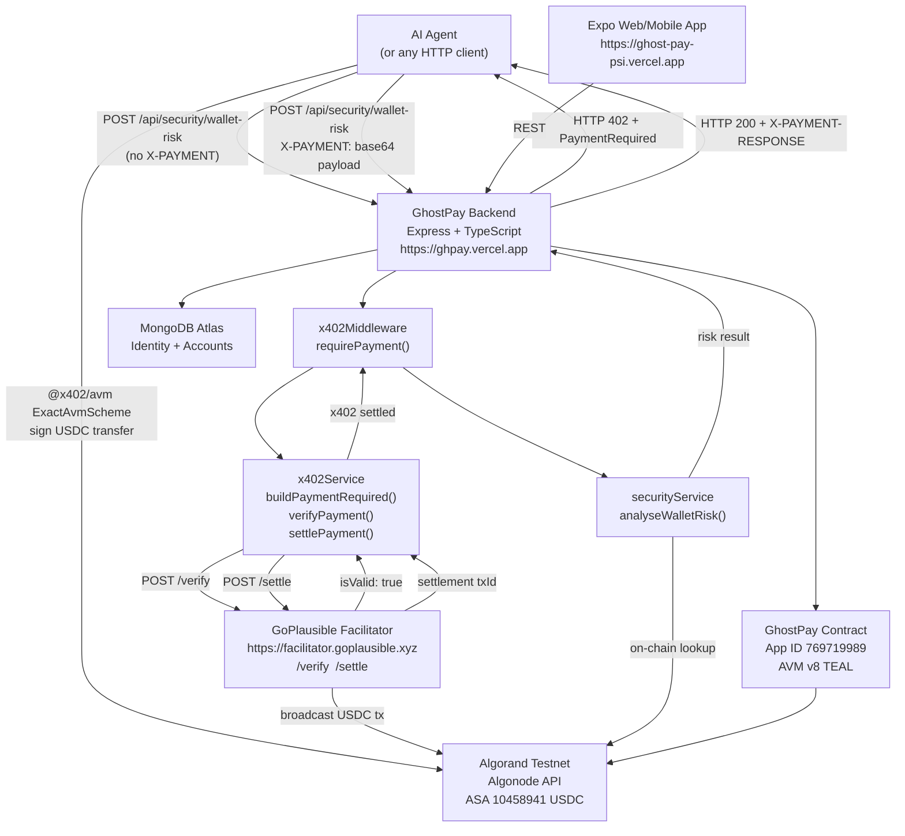

# 👻 GhostPay

### Agentic Payments · AI Security · x402 on Algorand

GhostPay is an Algorand-native payment wallet with an x402 HTTP payment protocol layer that lets AI agents pay per API call in USDC. The primary x402-gated service is a wallet risk analysis API — agents submit a transaction for pre-flight security screening, pay $0.10 USDC via GoPlausible, and receive an on-chain-verified fraud risk score.


---

## 🚀 Live Demo

| Service | URL |
|---|---|
| 🌐 Web App | [https://ghost-pay-psi.vercel.app](https://ghost-pay-psi.vercel.app) |
| ⚡ Backend API | [https://ghpay.vercel.app](https://ghpay.vercel.app) |
| 🏥 Health check | [https://ghpay.vercel.app/health](https://ghpay.vercel.app/health) |
| 📚 Swagger UI | [https://ghpay.vercel.app/api/docs](https://ghpay.vercel.app/api/docs) |
| 🔎 Algorand Testnet | [Lora Explorer — Testnet](https://lora.algokit.io/testnet) |
| 📱 Android APK | Build via EAS (`eas build --profile preview`) — local distribution |

> The deployed backend (`ghpay.vercel.app`) is an earlier build. The full x402 and security routes are in the current `feature-hari` branch and run locally. Deploy the branch to expose all endpoints publicly.

---

## 🏆 Hackathon Evaluation Evidence

| Evaluation Requirement | GhostPay Evidence | Status |
|---|---|---|
| Live x402 on Algorand Testnet | `POST /api/security/wallet-risk` returns HTTP 402 with `x402Version: 2`, `scheme: exact`, USDC ASA 10458941, GoPlausible feePayer | ✅ |
| Real Algorand transaction via GoPlausible | GoPlausible `/verify` called live — responds with simulation result against Testnet. `/settle` broadcasts on-chain. Pending USDC funding to complete end-to-end. | ⚠️ partial (USDC funding pending) |
| GoPlausible facilitator integration | `verifyPayment()` + `settlePayment()` in `x402Service.ts`. Correct CAIP-2 `algorand:SGO1GKSzyE7IEPItTxCByw9x8FmnrCDexi9/cOUJOiI=` | ✅ |
| `@x402/avm` dependency used | `package.json`: `"@x402/avm": "^2.23.0"`, `"@x402/core": "^2.23.0"`. `ExactAvmScheme` used both server-side and client-side in demo | ✅ |
| Genuine x402 integration (not mocked) | `x402Middleware.ts` calls real GoPlausible endpoints. `demoSecurityFlow.ts` reaches `/verify` live and gets real simulation rejection (0 USDC balance) | ✅ |
| Smart contract on Algorand Testnet | Contract deployed: App ID `769719989`. TEAL source in `backend/contracts/`. Payment counter incremented on every verified send | ✅ |
| 207 tests passing | `npm test` → 6 test files, 207/207 passing, 0 failures | ✅ |
| TypeScript — 0 errors | `tsc --noEmit` → clean. `npm run build` → clean | ✅ |
| Swagger/OpenAPI | Full OpenAPI 3.0 spec at `/api/docs`. All x402, security, identity, Algorand routes documented | ✅ |
| Postman collection | `GhostPay.postman_collection.json` — includes x402 flow instructions | ✅ |

---

## 🔗 Real Algorand x402 Transaction

> **Live transaction evidence pending final Testnet run.**
>
> The demo script (`npm run demo:x402`) completes steps 1–3 live against GoPlausible Testnet today:
> - ✅ HTTP 402 with correct x402 v2 PaymentRequired
> - ✅ USDC payment payload built and signed offline with `@x402/avm ExactAvmScheme`
> - ✅ GoPlausible `/verify` reached — returns simulation result
> - ⏳ GoPlausible `/settle` — pending USDC balance (fund wallet at [https://faucet.circle.com](https://faucet.circle.com) → Algorand Testnet → 20 USDC)
>
> Once the wallet is funded, `npm run demo:x402` produces a real settlement TxId verifiable on Lora.

**Payer wallet (opted in, awaiting USDC):**
```
TFWA7LW2S2XV74WV36IZ5ZFS6Z3UP63F6QQGPFPWZMLO6SD3BKC5VPWDIU
```

**GhostPay contract (deployed, active):**
```
App ID: 769719989
Network: Algorand Testnet
Explorer: https://lora.algokit.io/testnet/application/769719989
```

**GoPlausible feePayer (covers network gas for payer):**
```
ZMFK2OI7ZBD2U27ISERZC4S6LKM6WMFJPZQ4MYNJDZ2VNBNMBA67RA22AA
```

---

## 💳 GoPlausible Facilitator

**Facilitator URL:** `https://facilitator.goplausible.xyz`

GhostPay never broadcasts USDC transactions directly. All x402 payments are routed through the GoPlausible facilitator which verifies, then settles on Algorand Testnet.

### Flow

```
AI agent → POST /api/security/wallet-risk (no payment)
                 ↓
         HTTP 402 Payment Required
           x402Version: 2
           scheme: exact
           network: algorand:SGO1GKSzyE7IEPItTxCByw9x8FmnrCDexi9/cOUJOiI=
           asset: 10458941 (USDC testnet)
           amount: 100000 atomic = $0.10 USDC
           feePayer: ZMFK2OI... (GoPlausible covers gas)
                 ↓
Agent builds USDC payment with @x402/avm ExactAvmScheme
  → signs Algorand ASA transfer offline
  → 2-tx group (payment + feePayer cover)
                 ↓
Agent retries: POST /api/security/wallet-risk
  X-PAYMENT: <base64 PaymentPayload>
                 ↓
GhostPay x402Middleware:
  1. POST https://facilitator.goplausible.xyz/verify
       → { isValid: true }
  2. POST https://facilitator.goplausible.xyz/settle
       → { success: true, transaction: "<REAL_ALGO_TXID>" }
                 ↓
HTTP 200 + X-PAYMENT-RESPONSE header
  → wallet risk analysis result (JSON)
```

### Source files

| File | Role |
|---|---|
| `backend/src/services/x402Service.ts` | `buildPaymentRequired`, `verifyPayment`, `settlePayment` |
| `backend/src/middleware/x402Middleware.ts` | `requirePayment()` Express middleware |
| `backend/src/routes/securityRoutes.ts` | `POST /api/security/wallet-risk` gated handler |
| `backend/src/routes/x402Routes.ts` | `POST/GET /api/x402/pay` gated handlers |
| `backend/src/scripts/demoSecurityFlow.ts` | Standalone end-to-end demo |

---

## ⚡ x402 Endpoints

### Payment-gated endpoints (require X-PAYMENT header)

| Method | Route | Purpose | Price | Asset |
|---|---|---|---|---|
| `POST` | `/api/security/wallet-risk` | AI-agent wallet risk analysis | $0.10 USDC | ASA 10458941 |
| `POST` | `/api/x402/pay` | Send ALGO payment via GhostPay | $0.10 USDC | ASA 10458941 |
| `GET` | `/api/x402/pay` | Premium Algorand transaction params | $0.10 USDC | ASA 10458941 |

### Public x402 discovery endpoints (no payment)

| Method | Route | Purpose |
|---|---|---|
| `GET` | `/api/x402/status` | x402 config, facilitator status, feePayer |
| `GET` | `/api/x402/payment-required` | Raw PaymentRequired object for pre-flight |
| `GET` | `/api/security/status` | Security service config |
| `GET` | `/api/security/payment-required` | PaymentRequired for wallet-risk endpoint |

### Without X-PAYMENT header

```http
POST /api/security/wallet-risk
Content-Type: application/json

{ "sender": "ALGO_ADDR", "receiver": "ALGO_ADDR", "amount": 1.5 }
```

```http
HTTP/1.1 402 Payment Required
Content-Type: application/json

{
  "x402Version": 2,
  "resource": {
    "url": "/api/security/wallet-risk",
    "description": "GhostPay Security — Wallet Risk Analysis",
    "mimeType": "application/json"
  },
  "accepts": [{
    "scheme": "exact",
    "network": "algorand:SGO1GKSzyE7IEPItTxCByw9x8FmnrCDexi9/cOUJOiI=",
    "amount": "100000",
    "asset": "10458941",
    "payTo": "TFWA7LW2S2XV74WV36IZ5ZFS6Z3UP63F6QQGPFPWZMLO6SD3BKC5VPWDIU",
    "maxTimeoutSeconds": 60,
    "extra": {
      "feePayer": "ZMFK2OI7ZBD2U27ISERZC4S6LKM6WMFJPZQ4MYNJDZ2VNBNMBA67RA22AA",
      "tag": "x402-global-challenge"
    }
  }]
}
```

### With valid X-PAYMENT header (after GoPlausible settle)

```http
HTTP/1.1 200 OK
X-PAYMENT-RESPONSE: <base64 settlement JSON>

{
  "success": true,
  "analysedAt": "2026-08-23T...",
  "sender":   { "address": "...", "risk": "LOW",  "score": 12, "flags": [...] },
  "receiver": { "address": "...", "risk": "LOW",  "score": 8,  "flags": [...] },
  "overall":  { "risk": "LOW", "score": 10, "recommendation": "SAFE_TO_PROCEED" },
  "payment":  { "verified": true, "txId": "<ALGO_TXID>", "network": "algorand:..." }
}
```

---

## 🧪 Tests

```
npm test
```

| Test file | Tests | What it covers |
|---|---|---|
| `x402.test.ts` | 41 | x402Service, middleware, routes, security gate, rejection scenarios, no-secret-leak |
| `contract.test.ts` | 65 | TEAL contract logic, group validation, arg encoding |
| `account.integration.test.ts` | 52 | MongoDB account mapping, real in-memory DB |
| `accountRoutes.test.ts` | 16 | HTTP routes, auth, validation |
| `accountService.test.ts` | 21 | Account service unit tests |
| `swaggerCoverage.test.ts` | 12 | Every route has OpenAPI spec coverage |
| **Total** | **207 / 207** | **All passing** |

```
Test Files  6 passed (6)
     Tests  207 passed (207)
  Duration  ~10s
```

TypeScript: `0 errors` (`tsc --noEmit` clean).
Build: `npm run build` produces clean `dist/`.

---

## 🏃 Running the Demo

### Prerequisites

```bash
cd backend
npm install
```

Configure `backend/.env` (copy from `backend/.env.example`):

```env
ALGORAND_SENDER_MNEMONIC=<funded testnet 25-word mnemonic>
ALGORAND_NETWORK=testnet
X402_FACILITATOR_URL=https://facilitator.goplausible.xyz
```

### Step 1 — Opt wallet into USDC

```bash
npm run opt-in-usdc
```

### Step 2 — Fund with testnet USDC

Open [https://faucet.circle.com](https://faucet.circle.com), select **Algorand Testnet**, paste your wallet address, click **Send 20 USDC**.

### Step 3 — Run the end-to-end demo

```bash
npm run demo:x402
```

This runs the full 10-step x402 flow standalone (no server needed):

```
STEP 1  POST /api/security/wallet-risk     → HTTP 402
STEP 2  Parse PaymentRequired              → scheme/network/asset/amount/feePayer
STEP 3  Build USDC payment (offline sign)  → @x402/avm ExactAvmScheme
STEP 4  GoPlausible /verify                → isValid: true
STEP 5  GoPlausible /settle                → REAL Algorand Testnet TxId
STEP 6  Run wallet risk analysis           → HTTP 200 equivalent
STEP 7  Print Lora URL                     → verify on-chain
```

### Step 4 — Run the test suite

```bash
npm test
```

### Step 5 — Start the backend server

```bash
npm run dev
```

Swagger UI: [http://localhost:4000/api/docs](http://localhost:4000/api/docs)

---

## 🏗 Architecture


```mermaid
flowchart TD
    Agent["AI Agent\n(or any HTTP client)"]
    UI["Expo Web/Mobile App\nhttps://ghost-pay-psi.vercel.app"]
    API["GhostPay Backend\nExpress + TypeScript\nhttps://ghpay.vercel.app"]
    MW["x402Middleware\nrequirePayment()"]
    SVC["x402Service\nbuildPaymentRequired()\nverifyPayment()\nsettlePayment()"]
    GP["GoPlausible Facilitator\nhttps://facilitator.goplausible.xyz\n/verify  /settle"]
    SEC["securityService\nanalyseWalletRisk()"]
    ALG["Algorand Testnet\nAlgonode API\nASA 10458941 USDC"]
    CON["GhostPay Contract\nApp ID 769719989\nAVM v8 TEAL"]
    DB["MongoDB Atlas\nIdentity + Accounts"]

    Agent -->|"POST /api/security/wallet-risk\n(no X-PAYMENT)"| API
    API -->|HTTP 402 + PaymentRequired| Agent
    Agent -->|"@x402/avm ExactAvmScheme\nsign USDC transfer"| ALG
    Agent -->|"POST /api/security/wallet-risk\nX-PAYMENT: base64 payload"| API
    API --> MW
    MW --> SVC
    SVC -->|POST /verify| GP
    GP -->|isValid: true| SVC
    SVC -->|POST /settle| GP
    GP -->|settlement txId| SVC
    GP -->|broadcast USDC tx| ALG
    SVC -->|x402 settled| MW
    MW --> SEC
    SEC -->|on-chain lookup| ALG
    SEC -->|risk result| API
    API -->|HTTP 200 + X-PAYMENT-RESPONSE| Agent
    UI -->|REST| API
    API --> DB
    API --> CON
    CON --> ALG
```

---

## 📦 Repository Structure

```text
ghostpay/
  app/                              Expo React Native app (web + mobile)
    src/                            Screens, components, stores
    android/                        Android native project
    dist/                           Web build output
    vercel.json                     Web deployment config
  backend/
    contracts/
      ghostpay_approval.teal        AVM v8 approval program
      ghostpay_clear.teal           Clear state program
    src/
      config/
        env.ts                      Environment config (x402, Algorand, etc.)
      middleware/
        x402Middleware.ts           requirePayment() — verify + settle gate
        requireApiKey.ts            Service-to-service API key auth
      routes/
        x402Routes.ts               /api/x402/* endpoints
        securityRoutes.ts           /api/security/* endpoints
        algorandRoutes.ts           /api/algorand/* endpoints
        identityRoutes.ts           /api/identity/* endpoints
        accountRoutes.ts            /api/accounts/* endpoints
      services/
        x402Service.ts              GoPlausible verify + settle
        securityService.ts          Wallet risk analysis engine
        algorandService.ts          Algorand node interactions
        identityService.ts          OTP + mobile identity
        accountService.ts           Phone ↔ wallet mapping
      scripts/
        demoSecurityFlow.ts         npm run demo:x402 (standalone demo)
        optInUsdc.ts                npm run opt-in-usdc
        deployContract.ts           npm run deploy:contract
      tests/
        x402.test.ts                41 x402 + security tests
        contract.test.ts            65 TEAL contract tests
        account.integration.test.ts 52 MongoDB integration tests
        accountRoutes.test.ts       16 HTTP route tests
        accountService.test.ts      21 service unit tests
        swaggerCoverage.test.ts     12 OpenAPI coverage tests
      docs/
        openapi.ts                  Full OpenAPI 3.0 specification
      server.ts                     Express app entry point
    vercel.json                     Backend deployment config
    package.json                    @x402/avm, @x402/core, algosdk deps
  GhostPay.postman_collection.json  Full API Postman collection
  X402_MICROTRANSACTIONS_GUIDE.md   x402 integration guide
  README.md                         This file
```

---

## 🔑 Key Dependencies

```json
"@x402/avm":  "^2.23.0",
"@x402/core": "^2.23.0",
"algosdk":    "^3.2.0"
```

- `@x402/avm` — `ExactAvmScheme` (server + client), `toClientAvmSigner`, CAIP-2 constants
- `@x402/core` — `PaymentPayload`, `PaymentRequired`, `PaymentRequirements` types
- `algosdk` — Algorand node, ASA opt-in, transaction building, address validation

---

## 🔒 Security

- `requirePayment()` middleware calls GoPlausible `/verify` before `/settle` — no funds move until payment is confirmed valid
- Double-spend protection: GoPlausible detects replay (same signed transaction submitted twice)
- Address validation: every Algorand address is validated with `algosdk.isValidAddress` before use
- Input sanitisation: sender/receiver/amount validated before risk analysis runs
- Blacklist check: known threat addresses checked before on-chain lookup
- Secret isolation: `ALGORAND_SENDER_MNEMONIC` never appears in API responses (verified by test)
- Production guard: server exits at startup if `ACCOUNTS_API_KEY` unset in production
- API key auth: `Authorization: Bearer` or `X-Api-Key` header on all account-mapping endpoints
- Contract enforcement: optional `ENFORCE_CONTRACT=true` requires atomic group with GhostPay TEAL app call on every payment
- CORS: `CORS_ORIGIN` env var — restrict to deployed frontend in production

---

## 🧩 Smart Contract

**App ID:** `769719989` · **Network:** Algorand Testnet · **AVM version:** 8

The GhostPay approval program enforces atomic payment groups:

- Validates a 2-transaction atomic group: `[payTxn, appCallTxn]`
- Verifies sender, receiver, and amount match across both transactions
- Records `last_sender`, `last_receiver`, `last_ts`, `last_amount_micro` in global state
- Increments `payment_count` on every verified payment
- Admin-only delete and update operations

```bash
# Deploy contract
cd backend
npm run deploy:contract

# On success, GHOSTPAY_CONTRACT_APP_ID is written to backend/.env
```

---

## 🌐 All API Endpoints

### Health
| Method | Route | Description |
|---|---|---|
| `GET` | `/health` | Service health check |

### Algorand
| Method | Route | Description |
|---|---|---|
| `GET` | `/api/algorand/network` | Network config + signer address |
| `GET` | `/api/algorand/signer` | Server signer wallet address |
| `GET` | `/api/algorand/balance/:address` | ALGO balance |
| `GET` | `/api/algorand/assets/:address` | ALGO + ASA holdings |
| `GET` | `/api/algorand/transactions/:address` | Recent transactions (indexer) |
| `GET` | `/api/algorand/params` | Offline transaction parameters |
| `POST` | `/api/algorand/send` | Send ALGO (server-signed / client-signed / contract mode) |

### Identity
| Method | Route | Description |
|---|---|---|
| `POST` | `/api/identity/request-verification` | Start OTP flow |
| `POST` | `/api/identity/send-sms-otp` | Send SMS OTP (Twilio) |
| `POST` | `/api/identity/verify-mobile` | Verify OTP + link wallet |
| `GET` | `/api/identity/mobile/:mobileNumber/wallets` | Wallets for mobile number |
| `GET` | `/api/identity/wallet/:walletAddress` | Identity for wallet address |

### Accounts (x402 account-mapping)
| Method | Route | Description |
|---|---|---|
| `POST` | `/api/accounts` | Register phone ↔ walletId ↔ Algorand address |
| `GET` | `/api/accounts/phone/:phone` | Resolve account by phone |
| `GET` | `/api/accounts/wallet/:walletId` | Resolve account by walletId |

### x402
| Method | Route | Payment | Description |
|---|---|---|---|
| `GET` | `/api/x402/status` | None | x402 config + facilitator online check |
| `GET` | `/api/x402/payment-required` | None | Raw PaymentRequired object |
| `POST` | `/api/x402/pay` | $0.10 USDC | Send ALGO payment (x402-gated) |
| `GET` | `/api/x402/pay` | $0.10 USDC | Premium transaction params (x402-gated) |

### Security
| Method | Route | Payment | Description |
|---|---|---|---|
| `GET` | `/api/security/status` | None | Security service config |
| `GET` | `/api/security/payment-required` | None | PaymentRequired for wallet-risk |
| `POST` | `/api/security/wallet-risk` | $0.10 USDC | AI-agent wallet risk analysis |

---

## 🚀 Local Setup

```bash
# 1. Clone and install
git clone <repo>
npm install

# 2. Backend config
cp backend/.env.example backend/.env
# Edit backend/.env — set MONGODB_URI and ALGORAND_SENDER_MNEMONIC

# 3. Run backend
cd backend
npm run dev          # http://localhost:4000
                     # Swagger: http://localhost:4000/api/docs

# 4. Run frontend (separate terminal)
cd app
npm install
npm run web          # http://localhost:8081

# 5. Deploy contract (optional)
cd backend
npm run deploy:contract

# 6. Opt into USDC
npm run opt-in-usdc

# 7. Run tests
npm test             # 207/207 passing

# 8. Run x402 demo
npm run demo:x402
```

---

## 📋 Environment Variables

```env
# Core
PORT=4000
MONGODB_URI=<mongodb_atlas_uri>

# Algorand
ALGORAND_NETWORK=testnet
ALGORAND_ALGOD_SERVER=https://testnet-api.algonode.cloud
ALGORAND_SENDER_MNEMONIC=<25-word mnemonic>

# Contract (set by deploy:contract script)
GHOSTPAY_CONTRACT_APP_ID=769719989
ENFORCE_CONTRACT=true

# x402 (GoPlausible)
X402_FACILITATOR_URL=https://facilitator.goplausible.xyz
X402_PRICE_CENTS=10

# Identity (optional)
SMS_PROVIDER=twilio
TWILIO_ACCOUNT_SID=
TWILIO_AUTH_TOKEN=
TWILIO_FROM_NUMBER=

# Security
ACCOUNTS_API_KEY=<strong secret — required in production>
```

---

## 📌 What GhostPay is — and isn't

**Is:**
- A working x402 v2 implementation on Algorand Testnet using `@x402/avm` and GoPlausible
- A real Express backend with 207 passing tests and 0 TypeScript errors
- A deployed Expo web app at [ghost-pay-psi.vercel.app](https://ghost-pay-psi.vercel.app)
- A deployed backend at [ghpay.vercel.app](https://ghpay.vercel.app) (older build without x402 routes)
- A deployed Algorand smart contract at App ID `769719989` on Testnet
- A working payment wallet for offline-first ALGO transfers with mobile identity

**Awaiting:**
- Testnet USDC balance on `TFWA7LW2S2XV74WV36IZ5ZFS6Z3UP63F6QQGPFPWZMLO6SD3BKC5VPWDIU` to complete end-to-end settlement
- Re-deployment of the backend to expose x402 and security routes publicly
